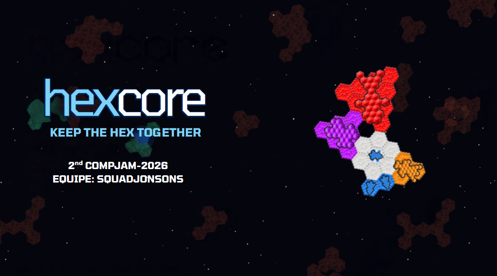

# HexCore
### *Keep the Hex Together*

---

## 1º Lugar na 2nd COMPJAM (UFRGS)

O **HexCore** foi desenvolvido pelo grupo **Squadjonsons** durante a **2nd COMPJAM da UFRGS** (Universidade Federal do Rio Grande do Sul), tendo sido premiado com o **1º lugar** na avaliação da competição.

- **Jogos apresentados na Jam:** [Ver todas as entradas da 2nd COMPJAM](https://itch.io/jam/2nd-compjam/entries)
- **Submissão do jogo no itch.io:** [Página do HexCore no itch.io](https://itch.io/jam/2nd-compjam/rate/5058231)

> **Nota sobre a versão do itch.io:**  
> A versão disponibilizada no itch.io corresponde à versão de entrega pontual submetida para avaliação dos juízes durante o evento. Ela não representa a versão final do projeto, que continuará em desenvolvimento ativo e receberá expansões futuras neste repositório.

---

## Sobre o Jogo

**HexCore** é um jogo de ação espacial inspirado no clássico *Asteroids*, desenvolvido na engine **Godot 4.7**. Cada elemento do jogo é modular e inteiramente composto por **células hexagonais**.

O jogador assume o controle de um núcleo (*core*) com o objetivo de sobreviver em meio a campos de asteroides e investidas de naves inimigas. Ao destruir rochas e adversários, é possível utilizar o **raio trator** para coletar e acoplar fragmentos de minério (para reforçar a blindagem) e canhões adicionais (para expandir o poder de fogo) em tempo real. Canhões organizados em formações triangulares se combinam automaticamente em armas de maior porte (Shotgun, Bomba e Laser). A partida avança ao longo de 3 minutos até o confronto contra o chefe **MEGATRON**.

## Como rodar
Abra a pasta no Godot 4.7 (Importar → `project.godot`) e aperte **F5**.

## Exportar (HexCore.exe)
O preset **Windows Desktop** (`export_presets.cfg`) exporta para `build/HexCore.exe` com o `.pck` **embutido no .exe** (`binary_format/embed_pck`): o jogo é um arquivo só e continua funcionando se o `.exe` for renomeado ou movido. Se aparecerem `libEGL.dll`/`libGLESv2.dll` ao lado (ANGLE, reserva do OpenGL), mantenha-as na mesma pasta do `.exe`. Antes da primeira exportação, instale os modelos em **Editor → Gerenciar Modelos de Exportação**. Depois: **Projeto → Exportar → Windows Desktop → Exportar Projeto**.

## Controles

| Ação | Entrada / Tecla |
|---|---|
| Mover a nave | <kbd>W</kbd> <kbd>A</kbd> <kbd>S</kbd> <kbd>D</kbd> ou setas (<kbd>↑</kbd> <kbd>←</kbd> <kbd>↓</kbd> <kbd>→</kbd>) |
| Arrastar minério ou canhão até a nave | <kbd>Clique Esquerdo</kbd> (segurar e soltar sobre o encaixe da nave) |
| Encaixe rápido automático | <kbd>Clique Esquerdo</kbd> (clique rápido dentro do alcance do raio trator) |
| Girar o pedaço arrastado | <kbd>Roda do Mouse (Scroll)</kbd> (passos de 60°) |
| Girar a nave na direção do cursor | <kbd>Clique Direito</kbd> (segurar) ou tecla <kbd>R</kbd> |
| Pausar partida / Acessar manual e opções | <kbd>Esc</kbd> ou <kbd>P</kbd> |
| Alternar tela cheia / janela | <kbd>F11</kbd> ou <kbd>Alt</kbd> + <kbd>Enter</kbd> |
| Pular tutorial inicial | <kbd>Enter</kbd> |
| Reiniciar partida (após Game Over / Vitória) | <kbd>R</kbd> ou botão na interface |

## Regras
- **Tutorial** (ativo no início da partida; <kbd>Enter</kbd> pula): primeiro surge um meteoro de 4 hexágonos, destruído automaticamente pelo núcleo e que sempre se divide em 2 fragmentos de 2 células; o jogo entra em câmera lenta e apresenta a mecânica de **montagem** (um clique rápido em um fragmento dentro do alcance acopla-o automaticamente; segurando o botão esquerdo, é possível arrastá-lo até a nave). Ao segurar o primeiro fragmento, surge a instrução para usar a roda do mouse e girá-lo em passos de 60°. Em seguida, surge um asteroide armado cujos disparos erram intencionalmente: ao ser destruído, ele solta duas peças, cada uma equipada com 1 canhão comum. O jogo entra em câmera lenta solicitando o acoplamento das peças. Com os dois canhões conectados à nave, uma janela explicativa pausada apresenta as **formações triangulares** de armas avançadas (3, 6 e 10 canhões) e ressalta que o canhão do núcleo não conta para fusão. Por fim, uma nova etapa de câmera lenta instrui sobre a **rotação da nave** (<kbd>R</kbd> ou <kbd>Clique Direito</kbd>). Todas as etapas de câmera lenta são concluídas quando o jogador executa a ação solicitada (ou por tempo limite). Os asteroides do tutorial não causam dano à nave, e o cronômetro da corrida só inicia após a conclusão. O tutorial pode ser desativado pela propriedade `tutorial_enabled` no nó `Game`.
- **Jogador**: inicia com 1 célula central, o *core* (núcleo branco com detalhes azuis `#3a7bff`), dotado de um canhão comum integrado que nunca se funde. Apenas células equipadas com canhões disparam, operando com **mira e disparo automáticos**: cada canhão calcula a mira antecipada e dispara no alvo válido mais próximo dentro do seu alcance. As demais células atuam como casco de proteção (*hull*). Se a ligação de qualquer bloco de células com o núcleo for interrompida por dano, o bloco se desconecta como pedaço flutuante e pode ser recuperado com o raio trator. **A partida só é encerrada quando o núcleo central for destruído.**
- **Asteroides**: surgem fora da tela com direção, velocidade e tamanho `n` (número de células, no mínimo 3) aleatórios, sofrendo deflexão e rotação em colisões mútuas. São destruídos após acumular `ceil(n^(3/2))` de dano. Ao colidir com a nave do jogador, o asteroide penetra destruindo células conforme seu tamanho (1 célula a cada 4 do asteroide, no mínimo 1). O asteroide não perde células na colisão e sofre 2 pontos de dano por célula destruída da nave, transpassando o corpo sem empurrão físico contínuo (apenas o MEGATRON bloqueia a nave fisicamente).
- **Inimigos (asteroides armados)**: possuem canhões idênticos aos da nave e disparam contra o jogador; cada impacto direto destrói uma célula da nave ou de um fragmento flutuante desprotegido. Tiros inimigos que atingem outros asteroides aplicam empurrão físico proporcional à massa do alvo sem causar dano. O cano da arma brilha em vermelho antes de cada disparo. As ondas seguem a progressão temporal definida em `config/enemies.tres`:

| Tempo | Máx. Simultâneos / Intervalo | Inimigos Disponíveis |
|---|---|---|
| 0:00 | 3 / 5,0 s | 1 a 3 canhões comuns |
| 1:00 | 4 / 4,0 s | + 1 a 2 shotguns |
| 2:00 | 5 / 3,5 s | + 1 lançador de bombas |
| 3:00 | — | Entrada do MEGATRON |

- **MEGATRON (Chefe)**: ao atingir a marca de 3 minutos na barra de navegação, a geração regular de asteroides cessa e o MEGATRON surge pela direita da tela: um veículo colossal com blindagem branca reforçada, dotado de canhões comuns, shotguns nas extremidades, lançadores de bombas centrais e um canhão laser de grande porte na dianteira. O combate é estruturado em 3 fases: primeiro a destruição das **torretas auxiliares** (enquanto laser e núcleo permanecem sob campos de força); após isso, a destruição do **laser frontal**; e, por fim, a eliminação do **núcleo central**. O chefe realiza patrulha vertical e suspende o movimento para emitir um feixe laser devastador que corta a tela horizontalmente (com aviso visual prévio de 3 segundos e disparo de 5 segundos). Destruir o núcleo encerra a partida em vitória.
- **Minérios e Coleta**: a destruição de asteroides gera fragmentos aproveitáveis de células conectadas (aproximadamente 20% das células dispersam-se como poeira espacial no impacto). As peças e canhões desprendidos derivam lentamente à deriva pelo espaço. Através do **raio trator**, o jogador pode segurar e arrastar peças para a nave ajustando a rotação em 60° com a roda do mouse, ou realizar um **clique rápido** para que a peça seja atraída e acoplada no primeiro encaixe compatível.

### Canhões
O canhão comum funciona como a unidade modular elementar do sistema de armamento: células adjacentes de canhão comum organizadas em formato de **triângulo** se fundem automaticamente em uma arma de maior porte correspondente (os triângulos maiores possuem prioridade de formação). O núcleo central é um canhão comum que permanece fixo e nunca se funde. Caso uma célula de uma arma avançada seja destruída, o agrupamento se desfaz e as células restantes reorganizam-se imediatamente no maior triângulo viável.

| Canhão | Cor | Formação | Especificações e Funcionamento |
|---|---|---|---|
| Comum | Azul (`#2f8cff`) | 1 célula | Disparo único frontal contra o alvo mais próximo com mira preditiva (recarga: 0.2 s, dano: 1.2, alcance: 700 px, velocidade: 750 px/s). |
| Shotgun | Laranja (`#ff9a1a`) | Triângulo de 3 comuns (lado 2) | Disparo simultâneo em leque de 7 projéteis no preset padrão (1 central e 3 para cada flanco; 5 projéteis no código base), dano de 1.5 por projétil e alcance de 700 px. |
| Bomba | Roxo (`#b44dff`) | Triângulo de 6 comuns (lado 3) | Lançamento de míssil balístico teleguiado (velocidade 150 px/s) que detona ao impacto, causando dano massivo em área circular (raio de explosão de 200 px). |
| Laser | Vermelho (`#ff2a2a`) | Triângulo de 10 comuns (lado 4) | Emissão de feixe contínuo e perfurante projetado para fora da nave (do núcleo em direção ao canhão), com alcance de 1000 px, duração de 5.0 s e dano por segundo constante. Mira direcionável através da rotação da nave (<kbd>Clique Direito</kbd> ou <kbd>R</kbd>). |

## Documentação Técnica

Para detalhes aprofundados sobre arquitetura de software, configurações de balanceamento e customização de interface, consulte a documentação dedicada:

| Documento | Descrição |
|---|---|
| [**Arquitetura do Projeto**](docs/ARQUITETURA.md) | Organização de scripts e cenas, ciclo de vida da partida, classes base hexagonais e otimização de renderização em lote (`TriBatch`). |
| [**Parâmetros e Balanceamento**](docs/BALANCEAMENTO.md) | Especificação das *Resources* (`.tres`), curvas de dificuldade, geração de asteroides, balanceamento de canhões, ondas inimigas e parâmetros do chefe MEGATRON. |
| [**Sistema de Interface e HUD**](docs/INTERFACE.md) | Resolução e escala dinâmica, componentes do HUD, sistema de moldura hexagonal 9-slice (`HexFrame`) e pipeline para inserção de texturas customizadas. |

## Equipe e Créditos
- **Desenvolvimento:** Grupo **Squadjonsons** (Projeto participante e 1º colocado na **2nd COMPJAM da UFRGS**).
- Fonte [Hexagon](https://fontstruct.com/fontstructions/show/1727445) por "twannieboy", sob a licença Creative Commons BY-NC-SA 3.0 (uso não comercial). Licença e leia-me em `fonts/Hexagon-*.txt`. Ela só tem letras sem acento, então os textos do jogo aparecem sem acentos.
- Fonte [Orbitron](https://fonts.google.com/specimen/Orbitron) (Matt McInerney), sob a SIL Open Font License, usada como reserva para números e pontuação. Licença em `fonts/Orbitron-OFL.txt`.
